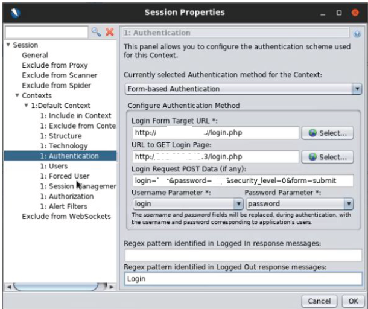
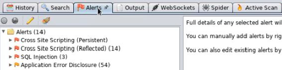

# WAPT-Web-Scanning-with-ZAProxy-Spider-Attack
Perform Spider attack to perform web scanning. I show only the important steps required to perform the attack, so, I didn’t explain everything.
# Introduction of the tool
ZAProxy is a web application security testing tool that can help you find and fix vulnerabilities in your web applications. It is free and open source, and it is maintained by a dedicated international team of volunteers. ZAProxy can be used to scan web applications for common security issues, such as SQL injection, cross-site scripting, broken authentication, and more. It can also be used to intercept and modify web traffic, perform active and passive scanning, spider web applications, and generate reports.
ZAProxy is designed to be easy to use, even for people who are new to security testing. It has a graphical user interface, a command-line interface, and a web interface. It also supports various automation options, such as scripting, API, and Docker . ZAProxy can be extended with add-ons that provide additional functionality, such as fuzzing, authentication, and AJAX support.  

The spider tool of ZAP proxy is a tool that can help you to automatically discover new resources (URLs) on a particular site. It starts with a list of URLs to visit, called the seeds, which depends on how you start the spider. Then, it follows the links on those pages and adds them to the list of URLs to visit. It also submits forms with predefined values to find more URLs. The spider tool can be configured to limit the scope, depth, and duration of the crawling process. You can use the spider tool to explore the structure and content of a web application, and to find potential vulnerabilities or hidden features.  
  
## Web scanning with ZAProxy
We perform the web scanning on bWAPP.  
### Goal: Scanning the site.  
Use nmap to scan the network and identify the ports that are running the http and mysql services. The ports must be OPEN. 
1) Open Owasp ZAP and navigate to all vulnerable page and enter some value to store the http request into js directory.
2) <b>In the directory js, right click on POST http request and select include default context</b>
3) Click on the <b>Authentication</b> tab under Default Context menu and select "<b>Form-based Authentication</b>".
4) Set the <b>Username parameter</b> to "<b>login</b>" and Enter "<b>Login</b>" in the "Regex pattern identified in Logged Out response messages"
   
5) In <b>User tab</b>, insert <b>user</b> and <b>password</b>
6) <b>Right click</b> on the Site and navigate to <b>"Include in Context"</b> and select on <b>"Default Context"</b>
7) <b>Right click</b> on the Site and navigate to <b>Attack</b> and select <b>"Spider"</b> (u will find urls vulnerable)
8) <b>Right click</b> on the Site and navigate to<b> Active Scan</b> to exploit the vulnerability found.
   
9) Navigate to the URL and Inject the XSS payload to the form.  

#Author
<b>Xiao Li Savio Feng</b>
